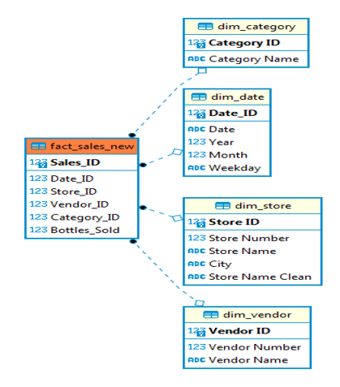

# Liquor-Sales-Analysis


# I. Introduction
This project focuses on designing and implementing a complete BI solution for analyzing alcohol sales in Iowa (USA), based on a real world dataset containing over 17 million transaction records. The project aims to support data-driven decision-making by uncovering key sales trends, identifying top-performing stores and vendors, and forecasting future demand. This end-to-end pipeline includes data cleaning, transformation, relational data modeling, SQL querying and interactive dashboard visualization.

# II. Data Description
Here is the link for the data: [LINK](https://drive.google.com/file/d/1L2s22XfL_Wtowbcx6ab1RwMu_EpXgzx8/view?usp=sharing)

Data description:
- Date: Transaction date
- Store Number: Unique ID of retail stores
- Store Name: Name of stores
- City: The place where the store is located
- Category Name: The name of alcohol category
- Vendor Number: Unique ID of distributors
- Vendor Name: Name of vendors
- Bottles Sold: Number of bottles sold in the transaction

# III. Methodology
## 1. Extract and Clean Data
Because this is a very large dataset, I prioritize uploading the file to Google Drive, then using Google Colabs to read the file. Avoid uploading the file directly to Google Colabs, which can crash halfway due to the file size being too large. Here is the first 5 rows of the dataset:


After successfully reading the data file, I will check the data types and if the data has missing values or not.


There are a lot of NA values in the City and Category Name columns. I will handle the City first:
The idea is to split the last word in the Store Name column to use as a reference to fill the City column. For example: INDY 66 WEST #929 / INDIANOLA, the world INDIANOLA will be splited and fill it in the corressponding row in City column if that place is missing. 

Afer this step, I will check if any of the rows with duplicated Store Numbers already have a City name. If so, interpolate for the remaining missing rows. And here is the result after the two-phase cleaning:


The NA value of the City column has decreased from 53231 to only 509. After considering the number of NAs compared to the number of records in the data (over 17 million), I will handle them by removing them from the dataset.

For NA values in the Category Name column, I will fill them with the mode value of this column. And for the remaining NA values in the 2 columns (Vendor Number and Vendor Name), I will remove them from the data. Here is the result of cleaning all of missing values:


Next, I will proceed to handle the duplicate records (about more than 2 million duplicated records by deleting them and keeping only the first record.


The number of records has dropped from 17 million to just over 15 million records.
## 2. Transform Data
In this step, I will create fact and dimension tables from the original data table. The purpose is to make it more convenient to store on the database, update, maintain and scale up in the future.

And here is the star schema that I have bulit for this dataset:

a. Dimension tables:

**dim_date**:
 - Date_ID (primary key)
 - Date
 - Year
 - Weekday
   
**dim_store**:
 - Store ID (primary key)
 - Store Number
 - Store Name
 - City
 - Store Name Clean (the shorter version of the store name

**dim_vendor**:
 - Vendor ID (primary key)
 - Vendor Name
 - Vendor Number
   
**dim_category**:
 - Category ID (primary key)
 - Category Name
   
b. Fact table (named fact_sales):
 - Sales_ID (primary key)
 - Date_ID (foreign key): refers to the “Date_ID” in dim_date
 - Store_ID (foreign key): refers to the “Store ID” in dim_store
 - Vendor_ID (foreign key): refers to the “Vendor ID” in dim_vendor
 - Category_ID (foreign key): refers to the “Category ID” in dim_category

Once I have the fact table, I need to check the EDA before loading them into the database. Specifically, check the distribution of the Bottles Sold column:


The distribution obviously has problem, it has negative value in min, -648 (The amount of bottles sold cannot be negative !!!) and the max value is also too big, 13,200 (there may be outliers). So, I will remove all of these noises by setting the positive threshold and using IQR to clean outliers. Let’s check the histogram and boxplot to see how it actually changes:


We can see that the distribution is more proper and there is no outliers either. The size of the dataset now is over 14 millions. It is ready to upload on the database.

 on Google Colabs to contain all the data tables, including: fact_sales_cleaned, dim_date, dim_store, dim_vendor, dim_category.

Next, I will use DBeaver (a database management software) to connect to the "sales.db" file to create a database accessed using SQLite. 

There is a problem when connecting to the database in DBeaver, which is that this software does not allow the creation of primary or foreign keys for tables created from the outside. So before querying, we need to recreate a fact table (fact_sales_new) as follows:
```sql
CREATE TABLE fact_sales_new (
	Sales_ID INTEGER PRIMARY KEY AUTOINCREMENT,
	Date_ID INTEGER,
	Store_ID INTEGER,
	Vendor_ID INTEGER,
	Category_ID INTEGER,
	Bottles_Sold INTEGER,
	FOREIGN KEY (Date_ID) REFERENCES dim_date("Date_ID"),
	FOREIGN KEY (Store_ID) REFERENCES dim_store("Store ID"),
	FOREIGN KEY (Vendor_ID) REFERENCES dim_vendor("Vendor ID"),
	FOREIGN KEY (Category_ID) REFERENCES dim_category("Category ID") )
```
Then, use the INSERT INTO function to transfer all data from the old fact table (fact_sales_cleaned) to the newly created table. This completes the step of creating a connection between data tables in DBeaver, ready to execute queries.
```sql
INSERT INTO fact_sales_new (Date_ID, Store_ID, Vendor_ID, Category_ID, Bottles_Sold)
SELECT "Date_ID", "Store ID", "Vendor ID", "Category ID", "Bottles Sold"
FROM fact_sales_cleaned
```


The tables are connected each other by 1-Many relationships. This schema meets the requirements:
- Normalization: Used primary keys for dimension tables, reducing redundancy
- Performance: Columns cleaned and deduplicated before merging, outliers removed in EDA
- Scalability: Star schema allows easy extension with new dimensions or measures
- Model clarity: Fact and dim tables are logically separated, easily visualizable in Power BI

## 4. SQL Query
*1) Total Bottles Sold per Year: Calculate the total number of bottles sold each year from 2017 to 2023.*
```sql
SELECT d.Year,
	SUM(f.Bottles_Sold) as Total_Bottles_Sold
FROM fact_sales_new f
JOIN dim_date d ON f.Date_ID = d.Date_ID
WHERE d.Year BETWEEN 2017 AND 2023
GROUP BY d.Year
ORDER BY d.Year ;
```


*2) Top 3 Vendors per City: Identify the top three vendors (Vendor Name) with the highest sales (by bottle count) in each city.*
```sql
WITH Vendor_Rank AS (
    SELECT s.City,
        	v."Vendor Name",
        	SUM(f.Bottles_Sold) AS Total_Bottles_Sold,
        	ROW_NUMBER() OVER (
            PARTITION BY s.City
            ORDER BY SUM(f.Bottles_Sold) DESC
        ) AS ranked
    FROM fact_sales_new f
    JOIN dim_vendor v ON f.Vendor_ID = v."Vendor ID"
    JOIN dim_store s ON f.Store_ID = s."Store ID"
    GROUP BY s.City, v."Vendor Name"
)

SELECT 
    City,
    "Vendor Name",
    Total_Bottles_Sold
FROM Vendor_Rank
WHERE ranked <= 3
ORDER BY City, Total_Bottles_Sold DESC ;
```


*3) Sales Analysis by Category: Analyze the sales trends for the top-selling wine categories (Category Name) year by year.*
```sql
SELECT d.Year,
	c."Category Name",
	SUM(f.Bottles_Sold) as Total_Bottles_Sold
FROM fact_sales_new f
JOIN dim_category c ON f.Category_ID = c."Category ID" 
JOIN dim_date d ON f.Date_ID = d.Date_ID
GROUP BY d.Year, c."Category Name" 
ORDER BY d.Year, Total_Bottles_Sold DESC ;
```


*4) Top Stores by Sales per City: Identify the stores (Store Name) with the highest wine sales in each city in the most recent year (2023).*
```sql
SELECT s.City,
	s."Store Name",
	SUM(f.Bottles_Sold) as Total_Bottles_Sold
FROM fact_sales_new f
JOIN dim_store s ON f.Store_ID = s."Store ID" 
JOIN dim_date d ON f.Date_ID = d.Date_ID 
WHERE d.Year = 2023
GROUP BY s.City, s."Store Name"
ORDER BY s.City, Total_Bottles_Sold DESC ;
```


*5) Vendor Sales Share: Calculate the percentage of total sales for each vendor (Vendor Name) compared to the overall sales of all vendors across the entire time period (2017-2023).*
```sql
SELECT v."Vendor Name" ,
	SUM(f.Bottles_Sold) as Total_Bottles_Sold,
	ROUND(100 * SUM(f.Bottles_Sold) /
	(SELECT SUM(Bottles_Sold) FROM fact_sales_new),2) as Percentage_Sales
FROM fact_sales_new f
JOIN dim_vendor v ON f.Vendor_ID = v."Vendor ID" 
GROUP BY v."Vendor Name" 
ORDER BY Percentage_Sales DESC ;
```


# IV. Visualization


This analysis aims to provide a comprehensive overview of liquor sales across the year 2017 to 2023. By designing a dimensional data model and building an interactive dashboard, we help stakeholders identify top-performing vendors, stores and product categories. These insights can support data-driven decisions in inventory planning, vendor selection, and sales strategy optimization.

Key insights and Recommendations:
1) Steady Sales Growth, slowing down in 2021-2022. From 2017 to 2020, sales increased sharply (13.7M  => 16.1M). Peaked at 16.5M in 2021 but then declined slightly in 2022 and recovered in 2023.

**Suggestions**: Review factors affecting the decline in 2022 (COVID, or change in partners, etc). Increase marketing campaigns during weak periods to maintain growth. 

2) Top 3 stores contribute nearly 2.5 million sales (~2.3% of total sales):
- HY-VEE #3: ~978K
- CENTRAL CITY 2: ~ 923K
- BENZ DISTRIBUTING: ~610K
  
**Suggestions**: These are strategic points of sale – need to prioritize supply, special care. Consider opening more branches near this area or analyze purchasing behavior here to apply to other areas.

3) Only 3 categories account for the majority of sales American Vodkas account for more than 20M bottles (nearly 20% of total sales). Canadian Whiskies & Straight Bourbons account for about 11M & 6M respectively.
   
**Suggestions**: Focus on promoting top categories more, as they already have a stable market. At the same time, consider repositioning or improving the weak product portfolio, expanding market share.

4) Top 3 vendors only account for ~35% of the market share => fragmented market:
- DIAGEO AMERICAS: 15.59%
- SAZERAC COMPANY INC: 10.64%
- LUXCO INC: 8.85%
  
**Suggestions**: Do not rely solely on large vendors – evaluate the performance of small vendors. Find new vendors to optimize costs, or coordinate with many vendors to ensure a stable supply chain.

5) Sales forecasting for 2025 and 2026: 
+ Sales are forecast to increase steadily, from 16.6M (2024) to 17.9M (2025), and to 18.5M (2026) => Growth trend returns after a slowdown in 2022. 
+ The growth rate is slowing down, from +6.5% (2023-2025) to +3% (2025-2026) => Attention should be paid to maintaining growth momentum.

**Suggestions**: Increase marketing and expand market share in the period 2025 & 2026 to take advantage of the uptrend. Control the risk of sales decline as happened in 2022. Focus on product groups and stores with high sales to optimize investment efficiency.

